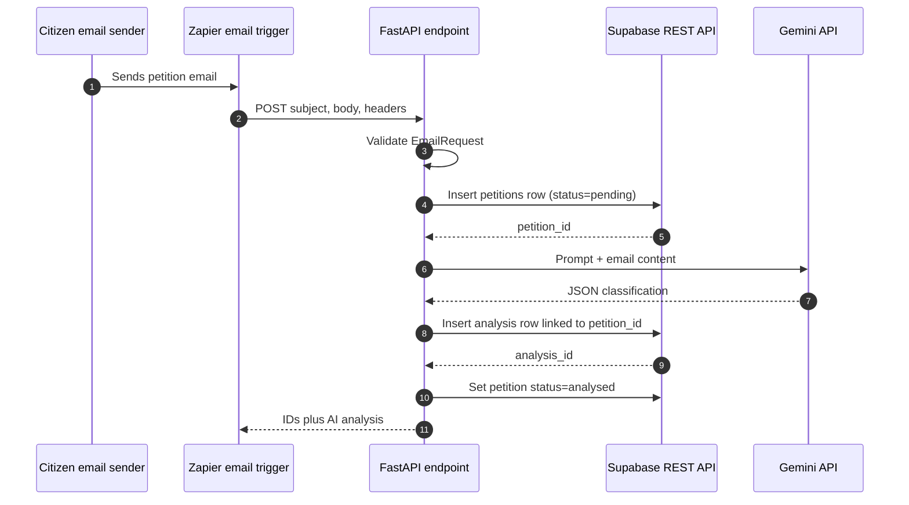

# AI Petition Processing System — Run Guide and Workflow

## What this repository contains

This is a Python/FastAPI backend for receiving citizen-petition emails through
Zapier. It persists each petition in Supabase, asks Gemini to classify it, then
stores the analysis in Supabase. There is no application frontend in the
current repository.

The `backend/email/` scripts are a separate Gmail-reading utility. They print
the latest Gmail messages to the terminal; they do **not** submit messages to
the FastAPI endpoint or automatically start the petition-processing workflow.

## Prerequisites

- Python 3.9 or newer (use a working Python installation)
- A Supabase project with its REST API enabled
- A Google Gemini API key with access to the model configured in
  `backend/app/services/gemini.py`
- Optionally, Zapier and a public HTTPS URL (for production email forwarding)
- Optionally, Google OAuth client credentials (only for the separate Gmail
  utility)

## 1. Create and activate a virtual environment

Run these commands from the repository root in PowerShell:

```powershell
py -3.11 -m venv .venv
.\.venv\Scripts\Activate.ps1
python -m pip install --upgrade pip
pip install -r backend\requirements.txt
```

`backend/requirements.txt` is the appropriate dependency file for the API. If
you plan to use the Gmail utility too, install its additional Google libraries:

```powershell
pip install google-auth-oauthlib google-api-python-client
```

## 2. Configure environment variables

Create or update the root `.env` file with these values. Do not commit this
file or any API keys.

```dotenv
SUPABASE_URL=https://YOUR_PROJECT_REF.supabase.co
SUPABASE_SERVICE_KEY=YOUR_SUPABASE_SERVICE_ROLE_KEY
GEMINI_API_KEY=YOUR_GEMINI_API_KEY
```

Important: the application loads `.env` from its current working directory.
Start Uvicorn from the repository root so it loads the root `.env` shown above.
The checked-in `.env` currently only defines `TOKEN_PATH` and
`CREDENTIALS_PATH`; those names are not read by the API services, so the three
variables above are still required for petition processing.

The service-role key bypasses Supabase Row Level Security. Keep it on the
server only—never put it in a browser, Zapier client-side code, or a public
repository.

## 3. Prepare Supabase tables

The API expects these tables and columns. `id` should be an auto-generated
integer primary key in both tables, and `analysis.petition_id` should reference
`petitions.id`.

| Table | Columns used by this code |
| --- | --- |
| `petitions` | `id`, `subject`, `body`, `status` |
| `analysis` | `id`, `petition_id`, `summary`, `department_code`, `priority`, `confidence`, `reason` |

The API creates petition rows with `pending`, later changes them to `analysed`,
and changes them to `analysis_failed` if Gemini fails.

## 4. Run the API

From the repository root, with the virtual environment active:

```powershell
python -m uvicorn app.main:app --app-dir backend --reload --port 8000
```

Then open the automatic API documentation at
<http://127.0.0.1:8000/docs>.

Useful health check:

```powershell
Invoke-RestMethod http://127.0.0.1:8000/api/v1/zapier/process-email
```

Expected response:

```json
{"status":"ok"}
```

## 5. Test the processing endpoint locally

With the server running, send a sample petition:

```powershell
$payload = @{
  subject = 'Delay in scholarship disbursement'
  body = 'My scholarship has not been credited for six months.'
  headers = @{ from = 'student@example.com'; message_id = '<sample@example.com>' }
} | ConvertTo-Json -Depth 3

Invoke-RestMethod `
  -Method Post `
  -Uri http://127.0.0.1:8000/api/v1/zapier/process-email `
  -ContentType 'application/json' `
  -Body $payload
```

Successful requests return the inserted `petition_id`, `analysis_id`, and
Gemini's `summary`, `department_code`, `priority`, `confidence`, and `reason`.

Run the automated test suite (it mocks Supabase and Gemini, so no cloud keys
are required):

```powershell
python -m pytest -q
```

## 6. Connect Zapier (production workflow)

1. Run the API on a public HTTPS address, for example via an approved hosting
   platform or a temporary tunnelling tool during development.
2. In Zapier, use an email trigger that extracts the subject, plain-text body,
   and optional headers.
3. Add a Webhooks by Zapier **POST** action to:
   `https://YOUR_HOST/api/v1/zapier/process-email`
4. Send JSON with the required `subject` and `body` strings. `headers` is
   optional and must be a JSON object.
5. Test the Zap. A `200` response means the petition and its analysis were
   saved; inspect Supabase to confirm both rows.

Example Zapier JSON body:

```json
{
  "subject": "{{email_subject}}",
  "body": "{{email_body_plain}}",
  "headers": {
    "from": "{{from_email}}",
    "date": "{{date}}",
    "message_id": "{{message_id}}"
  }
}
```

## End-to-end workflow



### Failure paths

- Invalid or missing `subject`/`body`: FastAPI returns `422` before any database
  write.
- Cannot insert the initial petition: FastAPI returns `500`; no AI call is
  made.
- Gemini request, model response, or JSON parsing fails: the code attempts to
  set the existing petition to `analysis_failed` and returns `500`.
- Saving the analysis fails: FastAPI returns `500`, but the petition remains
  `pending` because this branch does not change its status.
- Final status update fails: the endpoint still returns success; it logs a
  warning and the petition may remain `pending` even though its analysis row
  exists.

## Separate Gmail utility (optional)

`backend/email/auth.py` creates an OAuth token and `backend/email/gmail_client.py`
prints the newest Gmail messages. These commands must be run from a directory
where `credentials.json` is present. The scripts currently ignore the
`TOKEN_PATH` and `CREDENTIALS_PATH` settings in `.env`.

```powershell
cd backend\email
python auth.py
python gmail_client.py
```

`auth.py` opens a local browser-based Google OAuth consent flow and writes
`token.json` in the current directory. `gmail_client.py`, however, reads
`token.json` from the repository root, so copy/move the generated token there
or align the script paths before using the utility. Keep credentials and tokens
private.

## Current codebase findings

- The root `requirements.txt` and `pyproject.toml` do not consistently describe
  all runtime dependencies. Use `backend/requirements.txt` for the API, then
  add the two Google packages above for Gmail.
- The `gemini.py` service is configured with the literal model name
  `gemini-3.5-flash`. Confirm that this model is enabled for your Gemini API
  project, or update `candidate_models` to an available model.
- The endpoint has no authentication or webhook signature verification. Add a
  shared-secret/signature check before exposing it publicly, otherwise anyone
  who discovers the URL can create petitions and consume AI/database quota.
- No migration or SQL schema files are included, so Supabase tables must be
  created externally.
- The test suite covers the happy-path endpoint and prompt loading. It does not
  cover cloud integrations or the failure paths above.

