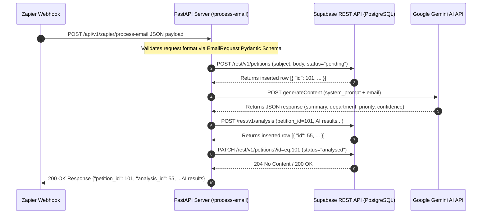

# 📚 Beginner's Guide: How the AI Petition Processing API Works

Welcome to the project! If you are new to **FastAPI**, **Supabase**, and modern Python web backend development, this guide is designed specifically for you.

---

## 🎯 Executive Summary & Overview

This system automatically processes citizen petition emails forwarded by **Zapier**, analyzes them using **Google Gemini AI**, and logs both the raw petition and the structured AI analysis into a **Supabase** database.

### What happens when an email arrives?
1. **Zapier** catches an email and sends an HTTP POST request to our FastAPI backend (`/api/v1/zapier/process-email`).
2. **FastAPI** validates the incoming email data.
3. **Database Step 1**: The backend saves the raw email into Supabase's `petitions` table with `status="pending"` and receives a unique `petition_id`.
4. **AI Step**: The backend sends the email body and subject to Google Gemini AI to summarize, extract the department code (e.g. `PWD`, `HEALTH`), assign a priority (`HIGH`, `MEDIUM`, `LOW`), and calculate confidence.
5. **Database Step 2**: The backend saves Gemini's output into Supabase's `analysis` table, linked to the `petition_id`.
6. **Database Step 3**: The backend updates the petition status to `"analysed"`.
7. **Response**: FastAPI returns the complete result (including `petition_id` and `analysis_id`) back to Zapier.

---

## 🔍 Mystery Solved: Where is the `db` Class?

### The Question
> *"I saw `db.insert_petition` in `zapier.py`, but I cannot find a `db` class anywhere in the code!"*

### The Answer
In Python, `db` is **not a class or object instance**—it is a **module alias**!

Look closely at **line 6** of [`backend/app/api/zapier.py`](file:///home/adithyan/Desktop/ProjectS7/ai_petition_processing_system/backend/app/api/zapier.py#L6):

```python
from app.services import supabase as db
```

#### Breakdown of how Python imports work here:
1. In the file system, there is a file located at [`backend/app/services/supabase.py`](file:///home/adithyan/Desktop/ProjectS7/ai_petition_processing_system/backend/app/services/supabase.py).
2. The statement `from app.services import supabase as db` tells Python:
   > *"Import the module inside `supabase.py`, but give it the nickname `db` inside this file so I don't have to keep typing `supabase.insert_petition`."*
3. So when you see:
   ```python
   petition_id = await db.insert_petition(...)
   ```
   You are calling the function `insert_petition()` defined directly in [`backend/app/services/supabase.py`](file:///home/adithyan/Desktop/ProjectS7/ai_petition_processing_system/backend/app/services/supabase.py#L27).

---

## 🚀 FastAPI 101: Understanding the Backend Framework

**FastAPI** is a modern, high-performance web framework for Python. Here is how it is structured in this repository:

### 1. Main Application (`backend/app/main.py`)
This is the server entry point.
```python
from fastapi import FastAPI
from app.api.zapier import router as zapier_router

app = FastAPI(
    title="AI Petition Processing System",
    description="FastAPI service for processing citizen petitions via Zapier & Gemini AI",
    version="1.0.0",
)

# Connects all routes defined in zapier.py to the main app
app.include_router(zapier_router)
```

### 2. Request Data Validation (`backend/app/schemas/zapier.py`)
FastAPI uses a library called **Pydantic** to enforce that incoming HTTP requests match expected data formats:
```python
from pydantic import BaseModel, Field
from typing import Dict, Any

class EmailRequest(BaseModel):
    subject: str
    body: str
    headers: Dict[str, Any] = Field(default_factory=dict)
```
- When Zapier sends JSON data to FastAPI, Pydantic checks if `subject` and `body` are strings.
- If data is missing or invalid, FastAPI automatically responds with an HTTP `422 Unprocessable Entity` error before executing any route code.

### 3. API Routers & Endpoints (`backend/app/api/zapier.py`)
```python
@router.post("/process-email", summary="Receive email from Zapier and process it")
async def process_email(request: EmailRequest):
    ...
```
- `@router.post("/process-email")`: A Python decorator that registers an endpoint listening for HTTP `POST` requests at `/api/v1/zapier/process-email`.
- `async def`: Defines an asynchronous function. Using `async`/`await` allows FastAPI to handle multiple incoming HTTP requests concurrently without getting stuck waiting for database or AI responses.

---

## ⚡ Supabase 101: How Database Interaction Works

### What is Supabase?
**Supabase** is a cloud platform built on top of **PostgreSQL** (a powerful SQL database). 
Besides standard SQL, Supabase automatically generates an HTTP REST API layer (using PostgREST). This means you can query, insert, or update data in your database using simple HTTP requests!

### How our app talks to Supabase (`backend/app/services/supabase.py`)
Instead of installing a heavy database driver or ORM (like SQLAlchemy), this app interacts with Supabase's REST endpoints using `httpx` (an asynchronous HTTP client in Python).

#### 1. Authentication Headers
```python
def _get_headers() -> Dict[str, str]:
    return {
        "apikey": SUPABASE_SERVICE_KEY,
        "Authorization": f"Bearer {SUPABASE_SERVICE_KEY}",
        "Content-Type": "application/json",
        "Prefer": "return=representation",  # Instructs Supabase to return the created row (including generated 'id')
    }
```

#### 2. The Three Supabase Functions:
- **`insert_petition(subject, body, status)`**:
  - Sends HTTP `POST` to `{SUPABASE_URL}/rest/v1/petitions`
  - Body: `{"subject": subject, "body": body, "status": "pending"}`
  - Returns: The new petition's integer `id`.

- **`insert_analysis(petition_id, summary, department_code, priority, confidence, reason)`**:
  - Sends HTTP `POST` to `{SUPABASE_URL}/rest/v1/analysis`
  - Body: JSON object containing all AI output fields linked to `petition_id`.
  - Returns: The new analysis row's integer `id`.

- **`update_petition_status(petition_id, status)`**:
  - Sends HTTP `PATCH` to `{SUPABASE_URL}/rest/v1/petitions?id=eq.{petition_id}`
  - Body: `{"status": status}` (e.g. `"analysed"` or `"analysis_failed"`).

---

## 🤖 Gemini AI Integration (`backend/app/services/gemini.py`)

1. **System Prompt**: Loaded from [`backend/app/prompts/petition_analysis.txt`](file:///home/adithyan/Desktop/ProjectS7/ai_petition_processing_system/backend/app/prompts/petition_analysis.txt). It instructs Gemini to classify petitions into specific department codes (like `PWD`, `REVENUE`, `HEALTH`), assign priority (`HIGH`, `MEDIUM`, `LOW`), summarize the issue, and output strict JSON.
2. **Execution**: The `analyze_email()` function sends a payload to the Google Generative Language REST API (`gemini-3.5-flash`).
3. **Parsing**: Cleans up any markdown codeblocks (` ```json ... ``` `) returned by Gemini and parses the response into a Python dictionary.

---

## 🔄 Complete End-to-End Workflow Diagram



---

## 📁 Key File Map

| File Path | Description |
| :--- | :--- |
| [`backend/app/main.py`](file:///home/adithyan/Desktop/ProjectS7/ai_petition_processing_system/backend/app/main.py) | **App Entry Point**: Initializes FastAPI instance and registers API routes. |
| [`backend/app/api/zapier.py`](file:///home/adithyan/Desktop/ProjectS7/ai_petition_processing_system/backend/app/api/zapier.py) | **API Route Handler**: Defines `/process-email` and orchestrates database logging and AI analysis. |
| [`backend/app/schemas/zapier.py`](file:///home/adithyan/Desktop/ProjectS7/ai_petition_processing_system/backend/app/schemas/zapier.py) | **Data Schema**: Defines `EmailRequest` model for Pydantic input validation. |
| [`backend/app/services/supabase.py`](file:///home/adithyan/Desktop/ProjectS7/ai_petition_processing_system/backend/app/services/supabase.py) | **Database Service (Aliased as `db`)**: Handles HTTP requests to Supabase PostgREST endpoints. |
| [`backend/app/services/gemini.py`](file:///home/adithyan/Desktop/ProjectS7/ai_petition_processing_system/backend/app/services/gemini.py) | **AI Service**: Calls Gemini API to analyze petition text. |
| [`backend/app/prompts/petition_analysis.txt`](file:///home/adithyan/Desktop/ProjectS7/ai_petition_processing_system/backend/app/prompts/petition_analysis.txt) | **Prompt Engineering**: The text prompt guiding Gemini AI's JSON output structure. |

---

## 💡 Quick Tips for Beginners

1. **Where do environment variables come from?**
   Variables like `SUPABASE_URL`, `SUPABASE_SERVICE_KEY`, and `GEMINI_API_KEY` are read from the `backend/.env` file via `python-dotenv`.
2. **How to run the backend locally?**
   From inside the `backend` folder:
   ```bash
   uvicorn app.main:app --reload --port 8000
   ```
3. **Interactive API Documentation**:
   FastAPI automatically generates interactive Swagger documentation! Once your server is running, visit:
   `http://localhost:8000/docs` in your browser.
